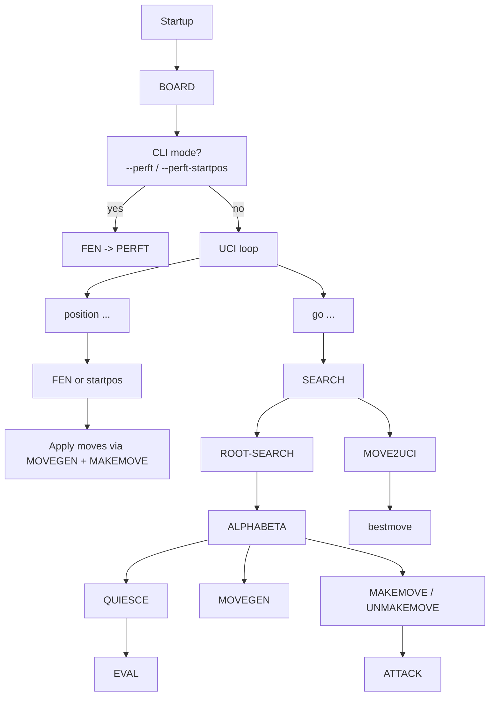

# Architecture of `cobochess`

`cobochess` is not just a parser wrapped around legal move generation. It is a conventional small chess engine implemented in GNUCobol with explicit records, shared copybooks, recursive search subprograms, an incremental hash key, and a full engine-vs-engine evaluation harness.

The design favors clarity and explicit state transitions over low-level cleverness:

- 0x88 mailbox board instead of bitboards
- struct-like move records instead of packed move integers
- pseudo-legal generation plus legality filtering via make/unmake
- full evaluation recomputation instead of incremental eval bookkeeping

That makes the code unusually readable for a chess engine, and especially readable for a COBOL codebase.

## 1. Codebase structure

### Engine modules

| File | Approx. lines | Responsibility |
| --- | ---: | --- |
| `src/main.cob` | 382 | Entry point, CLI modes, UCI loop, `position`, `go`, time allocation |
| `src/board.cob` | 30 | Clears and initializes `GAME-STATE` |
| `src/fen.cob` | 265 | Parses FEN, fills board state, computes Zobrist key from scratch |
| `src/attack.cob` | 164 | Answers "is this square attacked by side X?" |
| `src/movegen.cob` | 472 | Generates pseudo-legal moves on the 0x88 board |
| `src/makemove.cob` | 615 | Make/unmake, undo stack, legality filter, incremental hash maintenance |
| `src/perft.cob` | 66 | Recursive node counter for correctness testing |
| `src/eval.cob` | 387 | Static evaluation |
| `src/search.cob` | 1362 | Root iterative deepening, recursive alpha-beta, quiescence, move ordering, heuristics, TT |
| `src/time.cob` | 49 | Centisecond timer helper |
| `src/uci.cob` | 62 | Move-to-UCI string conversion |

### Shared data definitions

| File | Responsibility |
| --- | --- |
| `copybooks/constants.cpy` | Piece IDs, colors, flags, search constants |
| `copybooks/types.cpy` | `GAME-STATE`, `MOVE-REC`, `MOVE-LIST`, undo stack |
| `copybooks/searchstate.cpy` | Shared search counters, killer moves, history table, transposition table |
| `copybooks/hash.cpy` | External Zobrist tables and seed state |
| `copybooks/offsets.cpy` | Knight/king/bishop/rook offsets for 0x88 traversal |

### Tooling and data

| Path | Responsibility |
| --- | --- |
| `tests/perft_cases.json` | Regression positions for move generator correctness |
| `tools/perft_check.py` | Runs the perft suite against expected node counts |
| `tools/uci_smoke.sh` | Sends a minimal UCI session and checks for `uciok`, `readyok`, `bestmove` |
| `tools/engine_check.py` | Post-build smoke test with extra diagnostics, especially for macOS |
| `tools/elo_run.py` | Runs engine-vs-engine matches through `cutechess-cli` |
| `tools/elo_calc.py` | Computes Elo estimate and Wilson-interval confidence bounds from PGN results |
| `openings/` | Fixed opening suite for deterministic match starts |
| `results/` | Historical PGNs and JSON summaries from evaluation runs |
| `cutechess/` | Vendored third-party Cute Chess source/build tree, not engine logic |

## 2. Data model

### 2.1 `GAME-STATE`

The central structure is `GAME-STATE` from `copybooks/types.cpy`:

- `GS-PIECE(1..128)`: the 0x88 mailbox board
- `GS-SIDE-TO-MOVE`: `WHITE` or `BLACK`
- `GS-CASTLING`: 4-bit castling-rights mask
- `GS-EP-SQ`: en-passant square, or `-1`
- `GS-HALFMOVE` / `GS-FULLMOVE`: clocks needed for rules and FEN
- `GS-KSQ(1..2)`: cached king squares
- `GS-PLY`: current search ply
- `GS-KEY`: incremental Zobrist key
- `GS-UNDO(1..256)`: undo snapshots for make/unmake

The undo stack stores captured piece, moved piece, castling rights, EP square, clocks, king square, and previous hash key. That is enough to make/unmake without recomputing state from scratch.

### 2.2 Move representation

Moves are stored as explicit records:

- `M-FROM`
- `M-TO`
- `M-PROMO`
- `M-FLAGS`
- `M-SCORE`

This is slower and bulkier than the packed 16- or 32-bit move encodings common in C engines, but much easier to inspect and debug in COBOL.

`MOVE-LIST` is simply `ML-COUNT` plus up to 256 move records.

### 2.3 Search state

`copybooks/searchstate.cpy` defines the mutable state shared across recursive search:

- node counter
- stop flag
- search start time
- time limit
- periodic time-check countdown
- killer tables (`K1`, `K2`) indexed by ply
- history heuristic table (`16384` entries for from/to pairs)
- fixed-size transposition table with `1,048,576` entries

The TT stores key, depth, bound type, score, and best move fields.

### 2.4 Zobrist hash state

`copybooks/hash.cpy` declares an `EXTERNAL` hash state shared across COBOL programs:

- piece-square random numbers
- side-to-move key
- castling-rights keys
- en-passant file keys

The tables are initialized deterministically from a fixed LCG seed (`HS-SEED = 1`), which keeps runs reproducible.

## 3. Runtime architecture

At a high level, the engine runs like this:

## 4. Board representation and move legality

### 4.1 Why 0x88

The board uses a 128-element 0x88 mailbox. Valid squares are those where `sq mod 16 <= 7`.

This has a few practical consequences:

- off-board detection is cheap
- directional sliding code is simple
- knight/king offsets are natural
- code is easy to write in COBOL loops

It is slower than bitboards, but much simpler to maintain in this language.

### 4.2 Move generation

`MOVEGEN` is a pseudo-legal generator:

- pawns: pushes, double pushes, captures, en passant, promotions
- knights: offset stepping
- bishops/rooks/queens: directional sliding
- kings: single-square moves plus castling generation

Castling is generated only when:

- the corresponding castling right bit is set
- transit squares are empty
- the rook is on the expected original square
- the king is not in check
- the king does not cross attacked squares

### 4.3 Legality filtering

The engine does not generate only legal moves directly. Instead:

1. `MOVEGEN` emits pseudo-legal moves.
2. `MAKEMOVE` applies one candidate move.
3. `ATTACK` checks whether the moving side's king is left in check.
4. Illegal moves are rejected and immediately undone.

That is conventional, robust, and easier to reason about than embedding pin logic in the generator.

### 4.4 Make/unmake responsibilities

`MAKEMOVE` is the state-transition hub. It performs all of the following:

- saves an undo snapshot
- decodes move flags
- updates the incremental Zobrist key
- handles captures and en passant captures
- handles promotions
- moves rooks for castling
- updates cached king squares
- updates castling rights after king/rook moves or rook captures
- sets the en-passant square after double pawn pushes
- updates halfmove/fullmove counters
- flips side to move
- increments `GS-PLY`
- rejects illegal king-in-check positions

`UNMAKEMOVE` restores state from the undo stack, including the old hash key.

## 5. Search architecture

The engine's sophistication lives in `src/search.cob`. It contains three programs:

- `SEARCH`: root iterative deepening
- `ALPHABETA`: recursive principal search
- `QUIESCE`: capture extension at leaf nodes

### 5.1 Root search

`SEARCH` does the following:

1. Resets node counters and stores the time limit.
2. Initializes the TT once.
3. Clears killer/history heuristics when invoked with nonpositive depth.
4. Starts iterative deepening from depth 1 upward.
5. Carries the previous iteration's best move as the root PV move.
6. Uses aspiration windows from depth 3 onward.
7. Calls `ROOT-SEARCH`.
8. Emits `info depth ... nodes ... score cp ... pv ...` after each completed iteration.

Two notable implementation details:

- `uci` and `ucinewgame` use `SEARCH` with `max-depth <= 0` as an initialization/reset path for heuristics.
- The printed `pv` is only the current best move, not a reconstructed full PV line.

### 5.2 Root move ordering

Root moves are scored with:

- previous-iteration PV move priority
- capture ordering via MVV-LVA
- promotion bonuses
- a small castling bonus

Moves are then selected with a repeated "pick best remaining move" pass, effectively a simple selection sort during iteration.

### 5.3 Alpha-beta node logic

`ALPHABETA` is a negamax-style recursive search with a substantial set of classical techniques:

- node counting
- periodic time checks
- 50-move rule draws
- threefold repetition detection within the reversible window
- mate-distance pruning
- check extension
- transposition table probe/store
- null-move pruning
- principal variation search
- late-move pruning
- late-move reductions
- killer/history updates on beta cutoffs

This is a real engine search, not just depth-limited minimax.

### 5.4 Transposition table

The TT index is `GS-KEY mod TT-SIZE`. Entries store:

- position key
- depth
- bound flag (`EXACT`, `LOWER`, `UPPER`)
- normalized score
- best move fields

Mate scores are normalized relative to ply on store/probe so mates remain comparable across depths.

The TT is fixed at compile time. The engine advertises a UCI `Hash` option, but current code does not implement `setoption`, so the TT size is not actually configurable at runtime.

### 5.5 Null-move pruning

Null-move pruning is enabled only when:

- null move is allowed at this node
- the side to move is not in check
- depth is at least 4
- the side has some non-pawn material

That last condition is the standard hedge against zugzwang-heavy positions.

### 5.6 Late-move pruning and reductions

At low depths, quiet non-TT moves late in the move list may be skipped entirely (LMP). At higher depths, quiet late moves may first be searched at reduced depth (LMR), then re-searched at full depth if they improve alpha.

This is one of the main reasons the engine can search materially deeper than a naive implementation.

### 5.7 Move ordering heuristics

Move ordering combines several signals:

- TT move first
- previous-iteration PV move first at root
- promotions
- captures by MVV-LVA
- killer moves
- history heuristic scores

The engine does not use SEE, counter-move tables, or continuation history yet.

### 5.8 Quiescence search

When depth reaches zero, `ALPHABETA` hands off to `QUIESCE`.

`QUIESCE`:

- evaluates stand pat
- returns beta on stand-pat cutoffs
- applies a simple delta-pruning guard
- generates capture-only moves, while still allowing promotion pushes from `MOVEGEN`
- orders tactical moves by MVV-LVA plus promotion bonuses
- recursively resolves capture sequences

This prevents the worst horizon-effect failures while staying simple.

## 6. Static evaluation

`EVAL` computes the score from scratch each time. It is more than material-only, but still deliberately classical and lightweight.

### 6.1 Material

Piece values are conventional:

- pawn = 100
- knight = 320
- bishop = 330
- rook = 500
- queen = 900

Kings are not counted as material in the usual way, but king placement is evaluated separately.

### 6.2 Positional terms

The evaluation includes:

- pawn advancement and central-file preference
- isolated pawn penalties
- doubled pawn penalties
- passed pawn bonuses
- knight centralization
- bishop centralization
- rook 7th-rank bonus
- rook open/semi-open file bonuses
- mild queen centralization
- bishop pair bonus
- side-to-move tempo bonus

### 6.3 King evaluation

The engine distinguishes middlegame and endgame roughly by total non-pawn material.

Then it applies:

- king centralization in endgames
- king de-centralization in middlegames
- a crude pawn-shield term in front of both kings

### 6.4 What it does not do yet

It does not yet implement:

- mobility evaluation
- piece activity beyond coarse centralization
- trapped-piece motifs
- explicit weak-square analysis
- pawn hash / pawn-structure cache
- incremental evaluation

So the evaluation is stronger than the old README implied, but still intentionally modest.

## 7. Protocol and interfaces

### 7.1 CLI modes

`COBOCHESS` supports three top-level usage modes:

- `./bin/cobochess`
  - enter UCI loop
- `./bin/cobochess --perft-startpos <depth>`
  - start position perft
- `./bin/cobochess --perft "<fen>" <depth>`
  - arbitrary-position perft

### 7.2 Supported UCI subset

The parser currently handles:

- `uci`
- `isready`
- `ucinewgame`
- `position startpos moves ...`
- `position fen <6 fields> moves ...`
- `go depth N`
- `go movetime N`
- `go wtime ... btime ... winc ... binc ... movestogo ...`
- `stop`
- `quit`

### 7.3 Time management

If `go` is not fixed-depth and not explicit `movetime`, the engine allocates time roughly as:

- keep a 50 ms reserve
- estimate moves-to-go, clamped to `[10, 60]` and defaulting to `22`
- `think = remaining / moves_to_go + 0.8 * increment`
- cap usage to 20% of safe remaining time
- enforce a minimum of about 20 ms when possible

That is simple but practical for engine matches.

### 7.4 Important protocol caveats

- `setoption` is not implemented.
- `Hash` is advertised but ignored.
- `stop` is parsed, but because search is synchronous and input is not polled during search, it is not a true asynchronous interrupt.
- `go infinite`, `ponder`, node-limited search, and advanced UCI option handling are absent.
- `src/uci.cob` is only a move formatter, not the whole UCI subsystem.

The engine is still good enough for `cutechess-cli` tournaments under ordinary fixed-depth, movetime, and clock-based play.

## 8. Build, testing, and evaluation infrastructure

### 8.1 Makefile strategy

The Makefile does more than compile:

- disables parallel make for reliability
- applies macOS linker target workarounds
- forces Apple toolchain utilities ahead of GNU binutils on macOS
- re-runs a smoke check after building
- retries the build if the engine binary is malformed or unrunnable

This is defensive engineering for a small codebase that has clearly been exercised on macOS.

### 8.2 Correctness testing

`make perft` runs `tools/perft_check.py`, which validates:

- start position up to depth 5
- Kiwipete up to depth 4
- illegal en passant exposing the king
- promotions and capture-promotions

That is a strong signal that move generation, castling, en passant, promotions, and make/unmake are in decent shape.

`make uci-smoke` runs a minimal UCI exchange and checks that the engine produces a `bestmove`.

### 8.3 Tournament harness

`tools/elo_run.py`:

- checks engine availability
- ensures macOS binaries are runnable
- introspects Stockfish UCI options
- launches `cutechess-cli`
- optionally uses `openings/book.pgn` or `openings/book.epd`
- writes both PGN and JSON summary files under `results/`

This script supports both:

- Stockfish Elo-limited mode (`UCI_Elo`)
- weakened Stockfish skill mode (`Skill Level`)

### 8.4 Elo estimation

`tools/elo_calc.py` reads the PGN and estimates Elo difference from score, then computes a 95% confidence interval via a Wilson interval on half-points.

That is a sensible lightweight approach for a repo-level harness.

### 8.5 Historical results

`results/` contains many past runs with varying baselines and time controls. It should be read as an experiment log, not as one canonical published Elo claim. The scripts are the reliable way to recompute or extend that evidence.

## 9. Architectural strengths

What this engine does well architecturally:

- The state model is explicit and understandable.
- Legality is centralized in make/unmake and attack detection.
- Search is advanced enough to be interesting: TT, killers, history, PVS, null move, LMR/LMP, quiescence.
- The build and test story is much more mature than the old README suggested.
- Tooling around the engine is practical: perft, smoke, match runner, Elo calculator, deterministic openings.

For a COBOL project, that is a strong balance of correctness, maintainability, and capability.

## 10. Tradeoffs and current bottlenecks

The main tradeoffs are also clear:

- 0x88 plus explicit records is easy to reason about, but slower than bitboards and packed move encodings.
- Evaluation is recomputed from scratch every node.
- Move ordering uses simple repeated best-pick passes rather than more specialized structures.
- The TT is large and static in working storage.
- Protocol handling is intentionally minimal.
- There is no integrated opening book lookup or endgame tablebase support.

In short: the engine is structurally conventional, but performance-oriented only up to the point where the COBOL code remains readable and stable.

## 11. Obvious next steps

If this project keeps evolving, the most valuable next engineering moves are:

1. Implement proper `setoption` handling, especially real TT sizing.
2. Support asynchronous `stop` or another more faithful UCI interruption model.
3. Add full PV extraction rather than a one-move PV.
4. Introduce piece lists and incremental evaluation updates.
5. Add mobility and richer king-safety terms.
6. Integrate an actual opening book probe during search.
7. Improve move ordering further with SEE and richer history variants.
8. Consider whether the next performance jump should come from deeper optimization within 0x88 or from a more radical representation change.

As it stands, `cobochess` already documents a compelling point in that design space: a readable COBOL chess engine with real search machinery and a serious evaluation/test harness around it.
